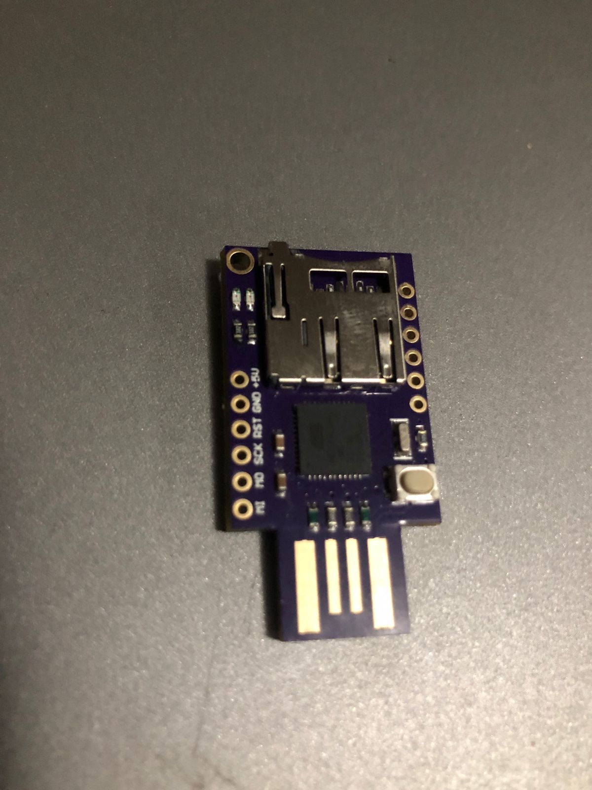
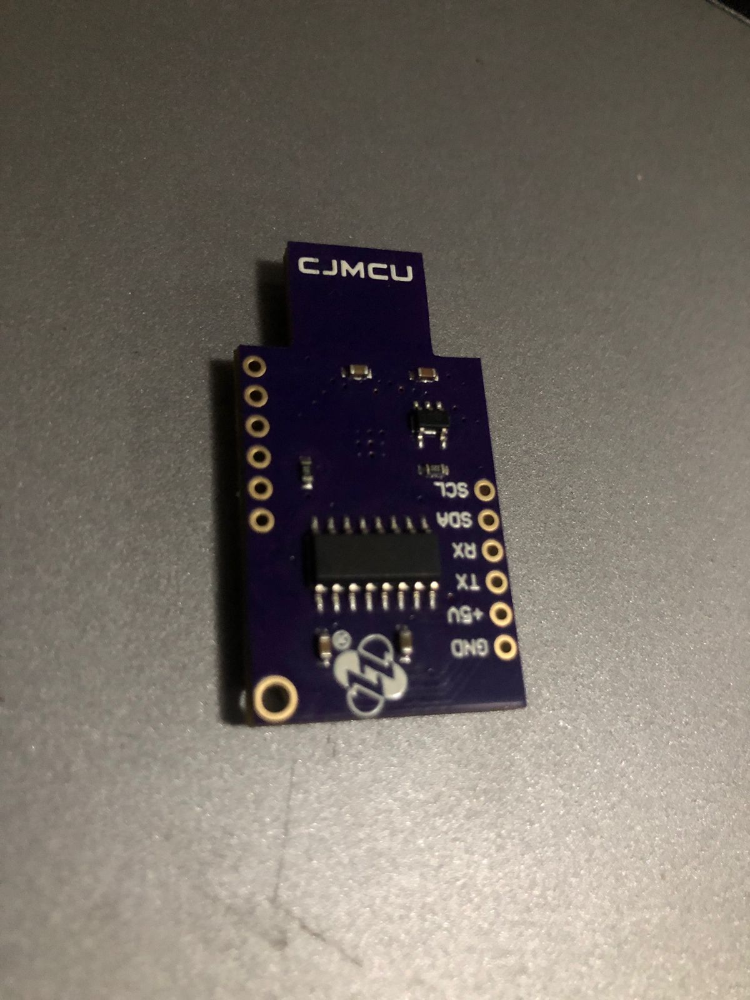
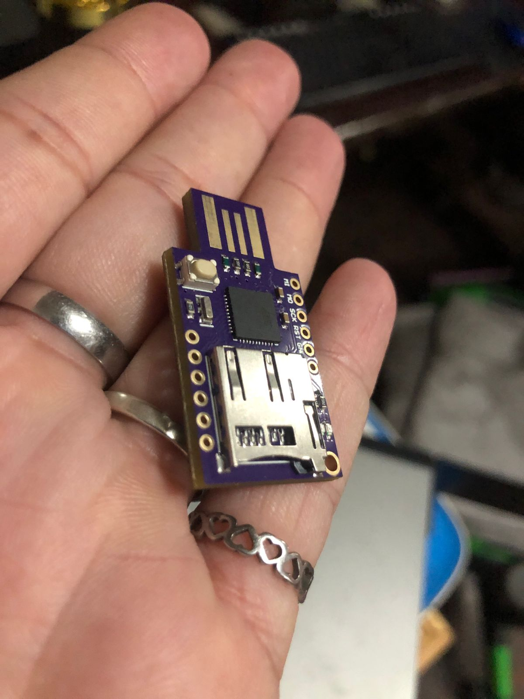

# 🦆 BadUSB / Rubber Ducky 

> Colección de scripts para dispositivos HID (Rubber Ducky, Flipper Zero, O.MG Cable) con fines educativos y de concientización en seguridad. 

---

## ⚠️ Aviso Legal

Estos scripts están desarrollados **únicamente con fines educativos y de concientización**. Su uso debe realizarse **exclusivamente en entornos controlados y con autorización explícita** del propietario del sistema. El autor no se responsabiliza por el uso indebido de este material.

---

## 📂 Scripts incluidos

### 🎭 Robador de Contraseñas
**Archivo:** `Robador_de_contraseñas_rubber_ducky.txt`  
Script donde atacara a las password.

---

**Finalidad:** Concientizar sobre por qué hay que bloquear la PC cuando no se la usa.

---

## 🛡️ ¿Cómo protegerte de ataques BadUSB?

- **Bloqueá tu PC** cuando te alejás aunque sea un momento (`Win + L`)
- **No conectes USBs desconocidos** — ni los que encontrás tirados
- Usá **políticas de bloqueo de dispositivos USB** en entornos corporativos
- Activá **Windows Defender Credential Guard**
- Guardá los archivos de tu gestor de contraseñas en ubicaciones no estándar

---

## 🔧 Hardware compatible

- Hak5 USB Rubber Ducky
- Flipper Zero (BadUSB mode)
- O.MG Cable
- Digispark / Arduino Leonardo (con adaptación)

---

## 📸 Hardware

---

## 👤 Autor

**Luis García** — [@LuisGarcia-InfoSec](https://www.linkedin.com/in/luis-garc%C3%ADa-8138762b6/)  
Analista de Ciberseguridad & Forense Digital · Buenos Aires, Argentina  
🌐 [proyects-luis.netlify.app](https://proyects-luis.netlify.app)

---

*Todos los scripts fueron probados en entornos controlados. Compartido con fines educativos.*
